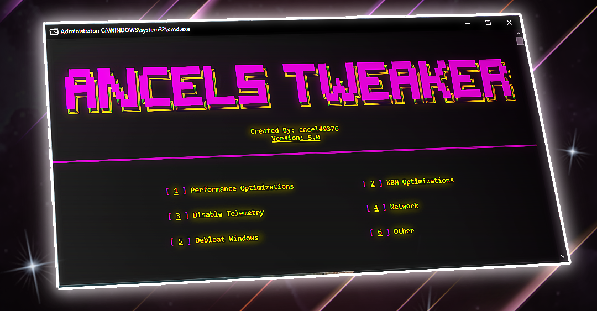

# 👏 About
Ancel's Performance Batch is an Open Source Tweaker that was designed to improve computer performance and latency. The Tweaker is interactive so it allows the user to optimize their pc however they please. It is important to note that the results may vary depending on the system's configuration.

# 🚨 Disclaimer
The author of this file cannot be held responsible or liable for any damages that may occur to your computer as a result of running this file. Use at your own risk.

# 💻 Requirements
- Windows 10
- Internet Connection
- Administrator Permissions

# ❓ How to Use?
1. Go to [Releases](https://github.com/ancel1x/Ancels-Performance-Batch/releases/tag/Latest)
2. Download **"AncelsPerformanceBatch.bat"**
3. Run AncelsPerformanceBatch.bat as Administrator
4. Press the Number # for the Optimization you want, and click Enter

# 🤝 Community
Feel free to join Ancel's Optimization Hub. The server was designed for those who are interested in tweaking, or are already tweakers. Here you can learn how to optimize your PC in many ways. Everything in the server is **free**. Nothing is paid or gatekeeped.

# 📜 License
Ancel's Performance Batch is Licensed under the [MIT License](https://opensource.org/licenses/MIT). For more information, visit [LICENSE](https://github.com/ancel1x/Ancels-Performance-Batch/blob/main/LICENSE)
